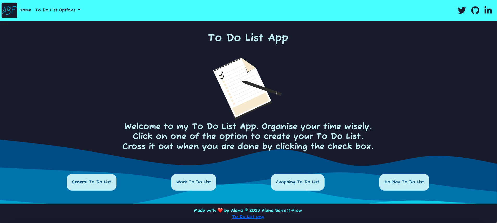
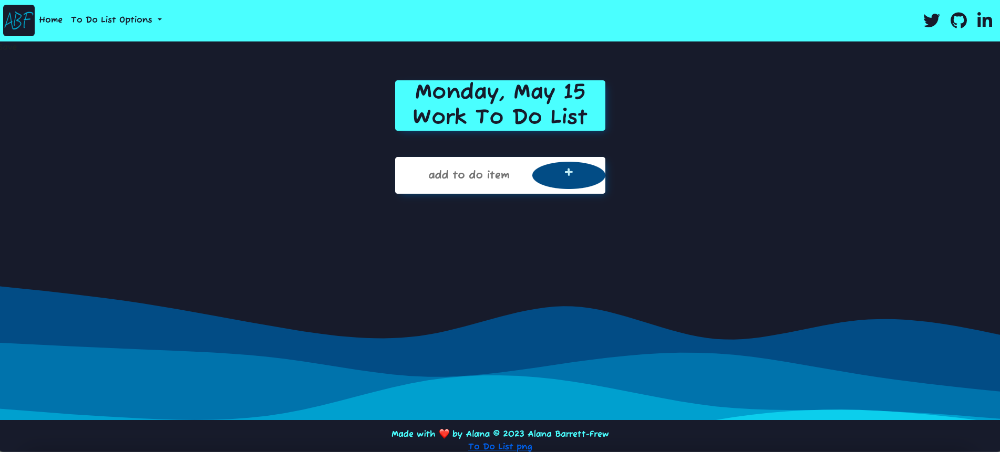

# to-do-list

## Table of Contents

* [Technology Used](#TechnolgyUsed)
* [Description](#Description)
* [Usage](#Usage)
* [License](#License)
* [Contributing](#Contributing)
* [Questions](#Questions)
## Technology Used

## Description
A to do list created using node.js, express and EJS

Deployed Site: https://to-do-list-planner.onrender.com/

## Usage
You can use this application to create a to do list. It displays the date and the ability to add items to the list and tick when they are complete. You can do a work list, a general list etc.

## Screenshots

## Contributing
*List of collaborators*
Alana Barrett-Frew
Partial use of Course material from Udemy The Complete 2023 Web Development Bootcamp, Dr. Angela Yu

## License
*This project is licensed under* [MIT](https://choosealicense.com/licenses/mit/)

## Questions
*Contact me if you have any questions or need to report a problem. Alternatively open an issue.*

Find me on GitHub: [AlanaBF](https://github.com/AlanaBF)

Email: [alanabarrett-frew@hotmail.com](mailto:alanabarrett-frew@hotmail.com)
